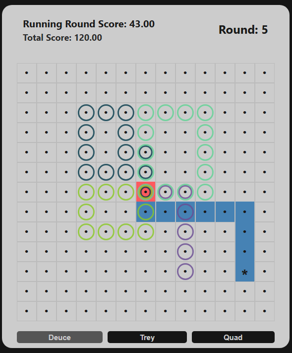

# Gotham Loops

## Overview

Gotham Loops is a strategy game of probability and risk management where players navigate a grid-based environment, trying to explore as much territory as possible and make it back home without getting caught. The game combines elements of pathfinding, risk assessment, and strategic planning across multiple rounds.

In Gotham Loops, each cell on the grid has a probability value that determines your chance of successfully visiting it. The farther you venture from the center "home" cell, the riskier your journey becomes. However, greater risks also offer greater rewards, as your score is primarily based on how far you travel from home.

To succeed, you'll need to carefully balance risk and reward while creating efficient routes through the grid.

## Features

- Three difficulty levels (Deuce, Trey, Quad) with increasing grid sizes and complexity
- Seven rounds
- Visual tracking of previously visited cells across rounds
- Real-time score calculation
- Probability-based game mechanics that adapt to your play style

## Online Game Rules

### Getting Started

1. Select your difficulty level:
   - **Deuce**: 13x13 grid (Beginner)
   - **Trey**: 17x17 grid (Intermediate)
   - **Quad**: 21x21 grid (Advanced)

2. The game begins at the center "home" cell (marked in red).

### Basic Gameplay

1. **Goal**: Explore cells to earn points and safely return to the home cell before ending the round.

2. **Movement**:
   - Click on any adjacent cell (up, down, left, or right) to move.
   - Diagonal movement is not allowed.
   
3. **Cell Probabilities**:
   - Each cell has a hidden probability value determining your chance of success when visiting it.
   - Cells closer to home are safer (higher probability of success).
   - Cells farther from home are riskier (lower probability of success).
   - The home cell always has a 100% success rate.

4. **Scoring**:
   - Score is based on the Manhattan distance from home (how many steps away).
   - Visiting cells farther from home earns more points.
   - Revisiting cells you've already been to in the current round earns no additional points.
   - Revisiting cells you've been to in previous rounds grants reduced points.

5. **Round Ending**:
   - A round ends when either:
     - You return to the home cell after exploring (success).
     - You "fail" a probability check when entering a cell (game over for that round).
   - When you fail a probability check, the cell will turn red, and your score for that round becomes zero.
   - When you successfully return home, the home cell turns green, and your score is saved.

6. **Multi-Round Strategy**:
   - After each round, the cells you visited and the adjacent cells become less risky in subsequent rounds.
   - Also after each round, the cells you visited become less valuable to revisit but adjacent cells retain their value.
   - Your total score accumulates across all seven rounds.

7. **Game Completion**:
   - The game ends after seven rounds.
   - Your final score is the sum of your scores across all rounds.

### Visual Indicators

- **Red Cell**: Home cell or failure point
- **Blue Cell**: Successfully visited cell in the current round
- **Colored Rings**: Cells visited in previous rounds (each round has a different color)
- **Cell with Asterisk (*)**: Your current position

## Playing Gotham Loops In Real Life

### Materials Needed

- Grid with:
  - 13×13 grid for "Deuce" difficulty
  - 17×17 grid for "Trey" difficulty
  - 21×21 grid for "Quad" difficulty
- Game marker or token
- 2-4 coins (depending on difficulty)
- Colored pens or markers (at least 7 different colors)
- Paper for scoring

### Setup

1. Draw your grid based on the chosen difficulty level
2. Mark the center cell as "Home" with a distinctive color
3. Place your game marker on the Home cell
4. Choose your difficulty:
   - Deuce: Use 2 coins
   - Trey: Use 3 coins
   - Quad: Use 4 coins
5. Assign a unique color to each of the 7 rounds you'll play

### Gameplay

1. **Starting the Game**:
   - Begin at the home cell in the center of the grid
   - You'll play for a total of 7 rounds
   - Use a different color marker for each round

2. **Moving**:
   - On each turn, move to an adjacent cell (up, down, left, or right)
   - Mark visited cells with the current round's color
   - Diagonal moves are not allowed

3. **Probability Check**:
   - When entering a new cell, determine your allowed number of flips:
     - Base flips = Maximum distance to any corner - Distance from home + 1
     - Extra flips calculation:
       1) Look at the current cell and its 4 adjacent cells (above, below, left, right)
       2) For each of these 5 cells, count how many unique previous rounds it was visited in
       3) Add these 5 counts together to get your total extra flips
     - Total flips = Base flips + Extra flips
   
   - Then perform the probability check:
     - Flip all your coins together (2, 3, or 4 depending on difficulty)
     - Success: If you get ALL HEADS in at least one of your allowed flips
     - Failure: If you never get all heads within your allowed number of flips

   - If you fail: The round ends immediately and you score 0 points for this round
   - If you succeed: Mark the cell with your current round's color and continue

4. **Scoring**:
   - For each newly visited cell in a round, earn points equal to:
     - Manhattan distance from home (|row distance| + |column distance|)
     - Subtract 1 point for each previous round in which the cell was visited
     - Points can never go below 0 for a cell
   - No points for revisiting cells within the same round
   - You must return to the home cell to secure your points for the round

5. **Ending a Round**:
   - Round ends when you either:
     - Return to the home cell (success - keep your score)
     - Fail a probability check (failure - 0 points for that round)

6. **Multi-Round Strategy**:
   - After each round, cells you visited (and their neighbors) become safer in future rounds
   - Previously visited cells are worth fewer points but their neighbors retain full value
   - Your total score accumulates across all seven rounds

### Scoring Example

**Round 1:**
- Home is at coordinates (6,6) in a 13×13 grid
- Moving to (6,7): 1 point (distance 1 from home)
- Moving to (6,8): 2 points (distance 2)
- Moving to (7,8): 3 points (distance 3)
- Moving to (7,7): 2 points (distance 2)
- Moving to (7,6): 1 point (distance 1)
- Moving to (6,6): 0 points (home cell)

Round 1 Score: 9 points
Total Score: 9 points

**Round 2:**
- Starting again at home (6,6)
- Moving to (5,6): 1 point (distance 1)
- Moving to (5,7): 2 points (distance 2)
- Moving to (6,7): 0 points (visited in Round 1, so 1-1=0)
- Moving to (6,8): 1 point (visited in Round 1, so 2-1=1)
- Moving to (5,8): 3 points (distance 3, not visited before)
- Moving to (5,7): 0 points (already visited this round)
- Moving to (5,6): 0 points (already visited this round)
- Moving to (6,6): 0 points (home cell)

Round 2 Score: 7 points
Total Score: 16 points

## Development

This game was built using:
- React
- TypeScript
- Vite

## License

This project is licensed under the MIT License - see the [LICENSE](LICENSE) file for details.

## Contact

randomplayables@proton.me
